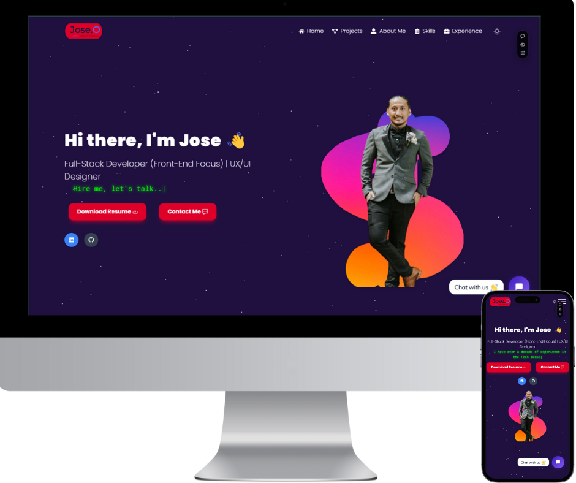

# 🌐 Jose Omolon - Portfolio Website

Welcome to my portfolio website repository! This project is a showcase of my journey as a web developer, reflecting my passion for crafting seamless, interactive, and user-friendly web experiences. It’s designed to highlight my skills and to connect with potential employers, collaborators, and clients.

**[Live Website](https://www.joseomolon.com/)**

 <!-- You can add a link to a screenshot image here -->

## 🎯 Project Overview

This portfolio website is a modern, responsive, and intuitive platform created to:
- Showcase my skills, projects, and professional journey.
- Act as a central hub for my portfolio, resume, and social links.
- Demonstrate my capabilities in **frontend and backend development**.
- Provide an interactive experience through **integrated AI-powered chat** for visitors.

## 🚀 Key Features

### 1. AI-Powered Chat
One of the most exciting features of this portfolio is the **integrated AI chat**, which gives visitors a unique, interactive way to learn more about my experience and skills. The AI chat is designed to:
- Answer questions about my skills, projects, and expertise.
- Provide recommendations on navigating the site.
- Allow for an engaging, conversational experience that feels like having a personal guide.

### 2. Modern Design and Responsive Layout
- Built with **HTML5**, **CSS3**, **JavaScript**, **React**, and **Tailwind CSS** for a smooth and dynamic user experience.
- Fully responsive design that ensures the site looks great on all devices, from desktop to mobile.

### 3. Framer Motion Animations
- Integrated with **Framer Motion** to add smooth, engaging animations throughout the site.
- Creates a lively, interactive feel, enhancing user engagement and showcasing creativity.

### 4. Interactive Components
- **Project Showcase**: A dedicated section that highlights my past work, complete with descriptions, tech stacks, and live links.
- **About Me Section**: An engaging bio where I share my career story, development philosophy, and key skills.
- **Contact Form**: Easily reach out to me through an integrated contact form for collaborations or inquiries.

## 💻 Tech Stack

| Technology         | Description                                    |
|--------------------|------------------------------------------------|
| **React**          | UI components for a dynamic user experience    |
| **JavaScript (ES6+)** | Core scripting language                     |
| **Tailwind CSS**   | Utility-first styling for responsive, modern visuals |
| **CSS3**           | Additional custom styling                      |
| **HTML5**          | Semantic and accessible structure              |
| **Framer Motion**  | Animation library for engaging user experience |
| **Node.js**        | Backend support for chat functionality         |
| **AI/ML API**      | Powers the AI chat for interactive Q&A         |
| **Git**            | Version control to track development progress  |
| **Vercel**         | Deployment platform for fast and reliable hosting |

## 🌐 Deployment
The site is deployed and live at **[joseomolon.com](https://www.joseomolon.com)**, hosted on **Vercel** for optimized performance, fast load times, and a seamless user experience.

## 🧠 AI Chat Integration
The AI-powered chat feature is one of the standout functionalities of this portfolio. It enhances the site by allowing visitors to interact with an AI that can:
- **Guide users** through the site and help them find specific information.
- **Answer questions** about my projects, tech stack, and experience.
- **Create a memorable interaction** that sets this portfolio apart from traditional sites.

## 🛠️ Installation & Setup

If you’d like to run this project locally:

1. **Clone the repository**:
   ```bash
   git clone https://github.com/JoseOmolon/PortFolioWebsite.git

2. ### Navigate into the directory:
```bash
cd PortFolioWebsite
```

3.### Install Dpendencies:
```bash
npm install
```

4. ### Run the developement Server:
```bash
npm start
```
Visit the site locally at http://localhost:3000.


### 📌 Future Improvements
- Enhanced AI Features: Expanding AI chat capabilities for personalized career advice.
- Dark Mode: Adding theme options for user customization.
- More Projects: Continuous updates with new projects and case studies.
